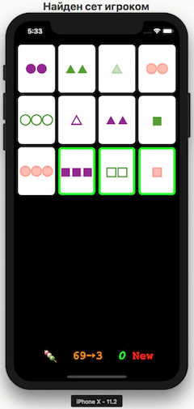
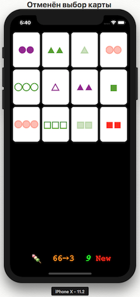
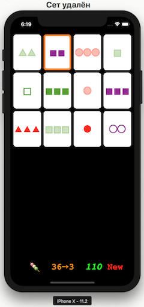
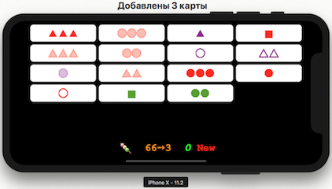
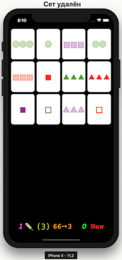
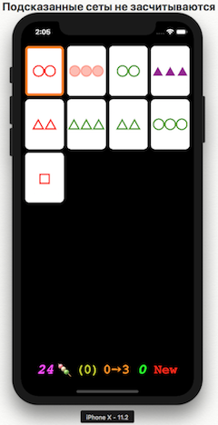
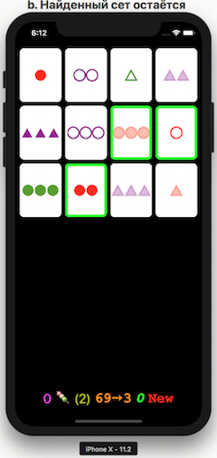
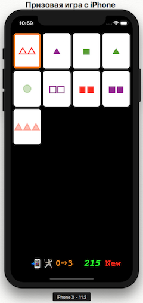

# GameSet_Assingment2
player vs iPhone
# Правила игры SET на iPhone

*	В игре участвует колода из 81 уникальной карты. Каждая карта имеет четыре признака, принимающих одно из трёх значений:
**Количество:** *на каждой карте может быть один, два или три символа.
**Цвет:** символы могут быть красными, зелёными или фиолетовыми.
** Форма:** символы могут быть квадратом, ромбом или кругом.
**Заполнение:** символы могут быть пустыми (контурными), а также полностью или частично закрашенными.

## Цель игры.
Найти максимальное количество наборов (сетов) в соответствии с условиями игры. Сет состоит из трёх карт, у которых каждый из признаков либо полностью совпадает, либо отличен на всех трёх.

## Ход и условия игры "соло" (для одного игрока).
В начале каждой новой игры на экране 12 карт. Указанная игроком карта становится выбранной и выделяется ***оранжевой*** окантовкой. Правильно указанный игроком сет выделяется ***зелёной*** окантовкой и при выборе любой другой карты не этого сета, найденный сет удаляется из игры, из колоды добавляются новые 3 карты, а к общему счёту (***зелёные*** цифры) прибавляются +10 баллов премии.  Повторным указанием можно отменить выбор, если было выбрано не более двух карт. За каждую отмену с общего счёта снимается 1 балл.

Заявленный набор не будет заменен, если после удаления найденного сета на экране остаётся не менее 12 карт. При ошибочном указании на сет, он выделяется ***красной*** окантовкой и от общего счёта отнимается  пенальти, если же сета среди всех карт на экране не было, то пенальти не начисляется. Величина пенальти зависит от количества карт на экране. При 12 картах пенальти будет =3 балла, при 15 =12, при 18 =21, при 21=30 и при 24 =39.
В любой момент времени, если в колоде остались карты, игрок может добавить на экран ещё три карты (до 24 карт)  кнопкой   **ХХ➙3**  ( ХХ слева от стрелки на кнопке - оставшееся число карт в колоде).
Этой же кнопкой, если в колоде остались карты, можно удалить указанный правильно сет с добавлением новых трёх карт, что возможно удобнее выбора другой карты.

Если он упустил возможность нахождения сета ( к примеру,  в начале игры, при 12 картах, сета может не оказаться всего в 32-х играх из 1000 ) начисляется штраф. Величина штрафа также зависит от количества карт на экране. На экране можно расположить 24 карты, но помните, что среди 21 карт сет есть всегда  и штраф за за добавление 3 карт будет увеличен до 36 баллов. При 18 картах на экране сета нет только в одной из миллиона игр и штраф за добавление 3 карт будет равен 27 . Штраф  при 15 картах за добавление ещё 3 карт составит 18 баллов(также и при 9 оставшихся в конце игры картах). При 12 картах штраф за добавление 3 карт составит 9 баллов.

Для обучения может использоваться кнопка  ( "hanamiDango"  или "трёхцветное данго", - самые древние японские сладости праздника любования цветами сакуры  [от hana «flower» и mi «to see»], преподносились богам как дары с надеждой на помощь и поддержку). При нажатии на эту кнопку отменяется выбор карт, если он был сделан, за исключением найденного сета. Кроме того зелёной окантовкой карт показывается один из возможных сетов в позиции где была нажата кнопка (при этом, каждый подсказанный сет компенсируется вычитанием (-10) баллов, т.е. уменьшает максимально возможное число баллов за игру на 10, таким образом сет не засчитывается), слева от кнопки показывается число подсказанных сетов, а справа (в скобках)- число возможных сетов в данной позиции, а затем и во всех последующих. Если сета не обнаружено, то число подсказок в таком случае не увеличивается.

Если перед нажатием кнопки  был найден сет ( рис. а.), то найденный сет и число подсказок не меняется, и лишь показывается число возможных сетов (рис. b). Баллы за найденный игроком сет засчитываются в полной мере (не компенсируются).
  
 
Игра "соло" (для одного игрока) заканчивается при пустой колоде, когда каждая из 81 карт побывала на экране, а игрок не может обнаружить сет, даже с подсказкой ( в таком случае на экране чаще всего остаётся 6 или 9 карт и реже 12 и более).
С помощью кнопки **New** всегда можно начать новую игру "соло".
 

## Ход и условия игры c iPhone в качестве противника.
Если было набрано не менее 180 баллов и в ходе игры не использовалась кнопка подсказки  , то по окончании игры "соло" она меняется на  и появляется возможность призовой игры с iPhone  , при этом ограничение времени на ход игрока пропорционально набранным очкам. Если было набрано не менее 230 баллов, то вместе с наградой , лимит времени на ход игрока дополнительно увеличивается на 20%. Если было набрано меньше 230 баллов, то за призовую игру присуждается .
После включения призовой игры кнопкой  появляется **фиолетовый** (крайний слева) индикатор баллов, набранных iPhone. При игре с iPhone время на ход игрока показывается индикатором  . Если время игрока выйдет, то очередь хода "переходит" к iPhone  . При нажатии на кнопку  за найденный сет iPhone получает 10 баллов, этот сет удаляется, а в новой позиции очередь хода переходит к игроку. Сет, найденный игроком, удаляется (или заменяется) автоматически - своего рода компенсация за игру в условиях ограничения времени. Так же, по сравнению с одиночной игрой, в момент когда очередь хода переходит к iPhone, выбор игрока отменяется без пенальти.
.
Когда игра заканчивается при обнаружении всех 27 сетов без штрафов и пенальти, игрока ждёт Супер-приз   - при игре с iPhone лимит времени на ход игрока увеличивается вдвое!
При  победе iPhone    возможность призовой игры пропадает и можно кнопкой **New** вернуться в игру "соло". При победе игрока или ничьей , нажав кнопку   , можно повторно сыграть с iPhone.
